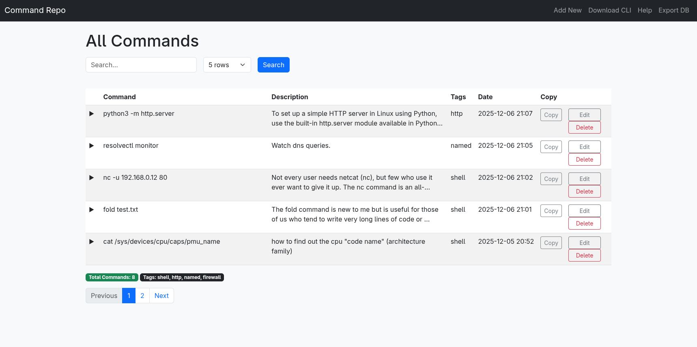

# Command‑CLI  

*A lightweight Flask API for storing, searching and managing shell commands.*

## Quick Start

```bash
git clone https://github.com/ftsiadimos/command-cli-repo
python -m venv .venv
source .venv/bin/activate
pip install -r requirements.txt
python app.py   # starts on http://127.0.0.1:5000
```

## API Overview

| Method | Endpoint | Description |
|--------|----------|-------------|
| `POST` | `/api/commands` | Add a new command. |
| `GET`  | `/api/commands` | List commands (optional `search` query). |

### Add a Command

```bash
curl -X POST http://localhost:5000/api/commands \
     -H "Content-Type: application/json" \
     -d '{"command":"ls -l","description":"List files","tags":"filesystem,list"}'
```

**Response**

```json
{ "id": 1, "command": "ls -l" }
```

### Retrieve Commands

```bash
curl http://localhost:5001/api/commands?search=git
```

**Response**

```json
[
  { "id": 2, "command": "git status", "description": "...", "tags": "git,repo" },
  ...
]
```

## Screenshot



---  
